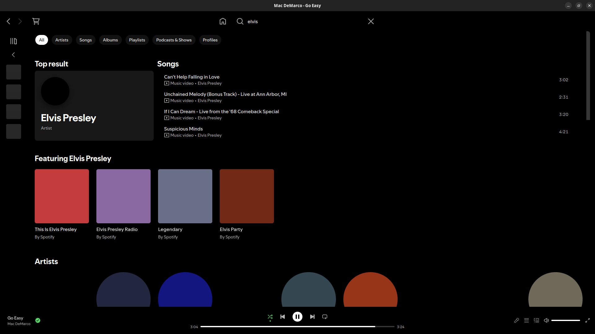
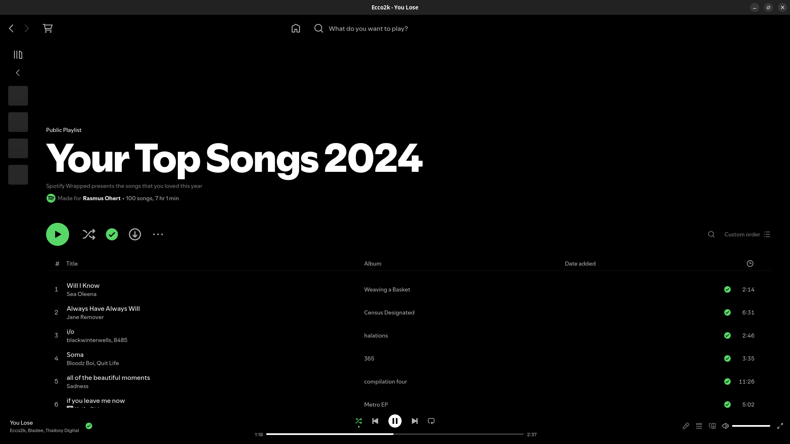
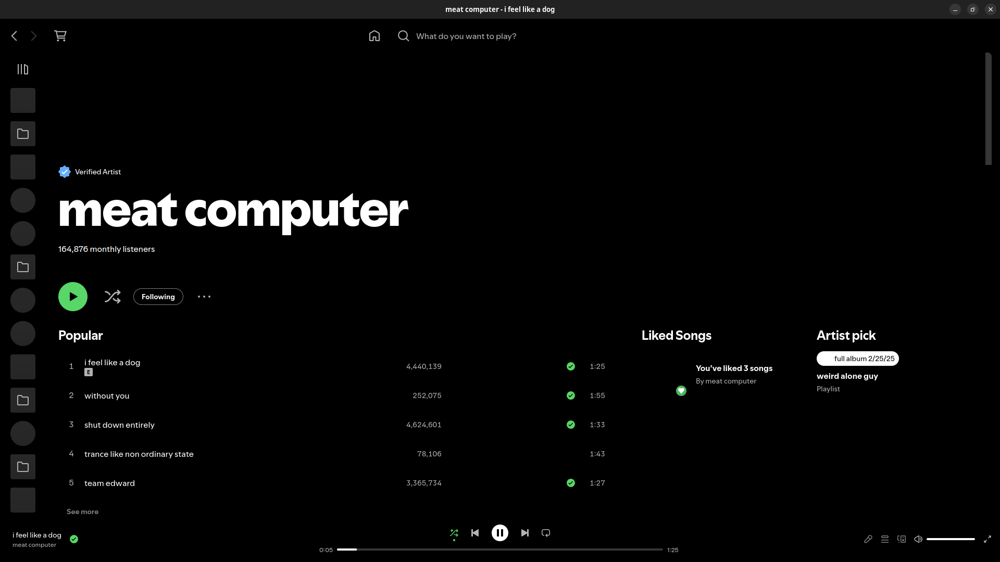
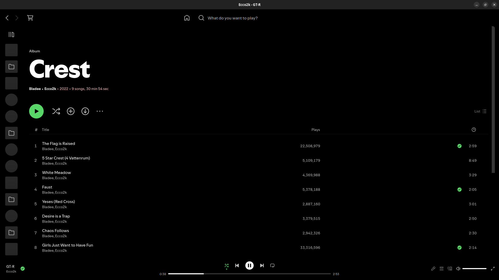
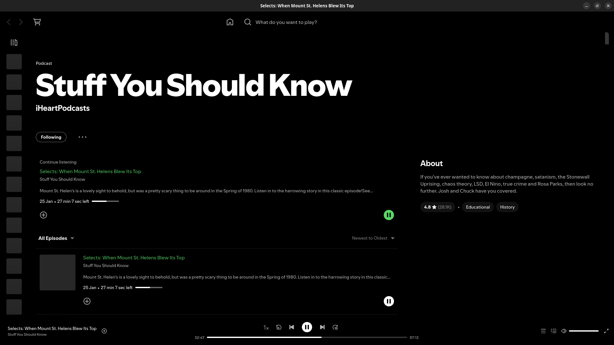
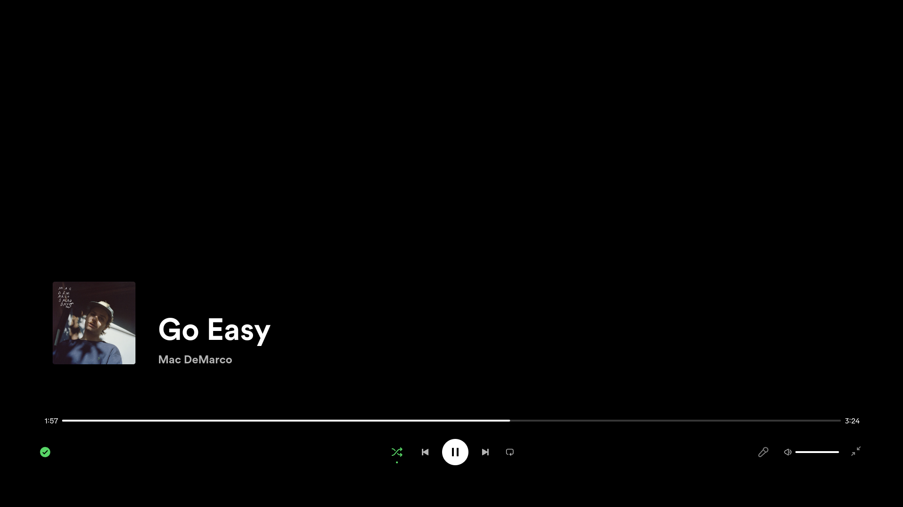
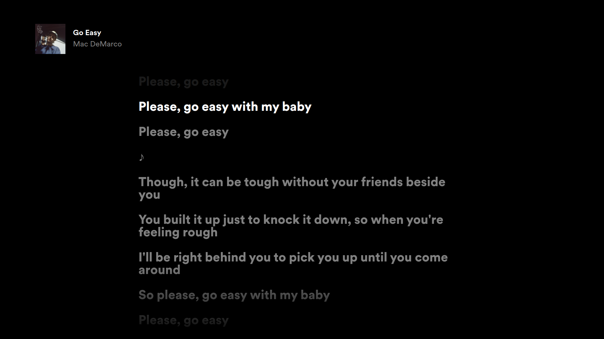
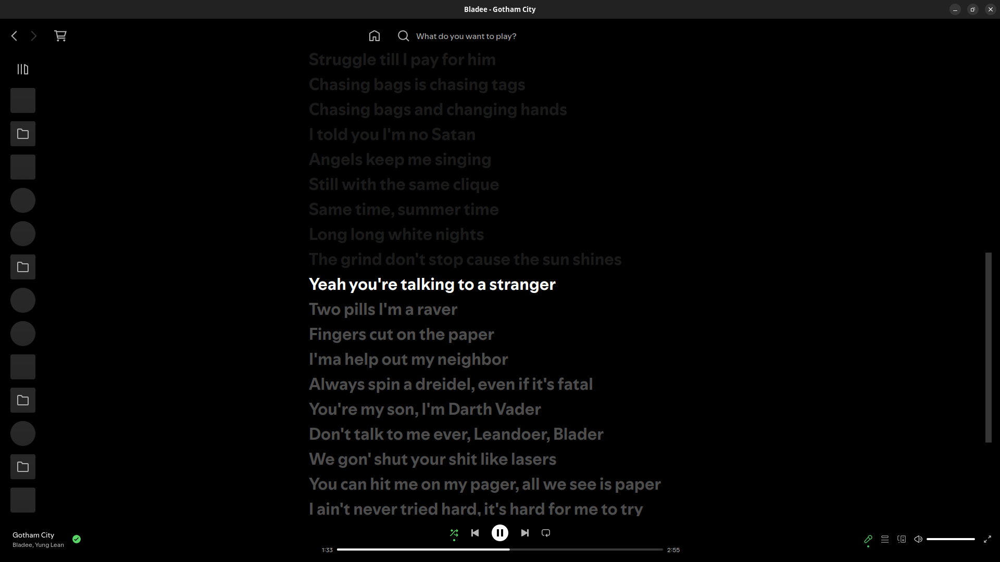
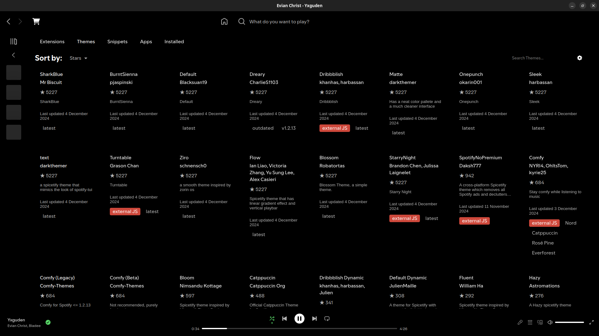
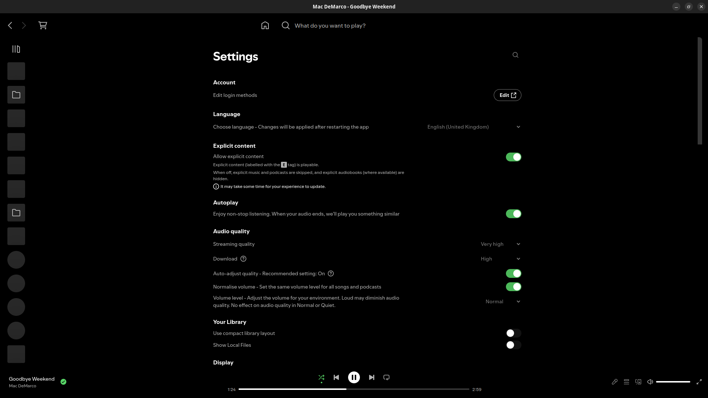

# Amoledify for Spicetify

## Screenshots

|  |  |  |
| :---: | :---: | :---: |
| home | search | playlist |
|  |  |  |
| artist | album | podcast |
|  |  |  |
| fullscreen active | fullscreen inactive | fullscreen lyrics |
|  |  |  |
| lyrics | marketplace | settings |

## More

Minimalistic theme for Spicetify with amoled colors.

Also removes clutter and makes the UI more compact. (May remove something you like, so be sure to check the code and modify it to your liking)
